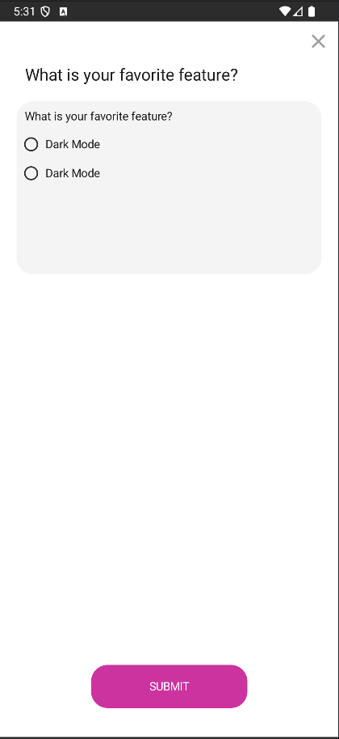
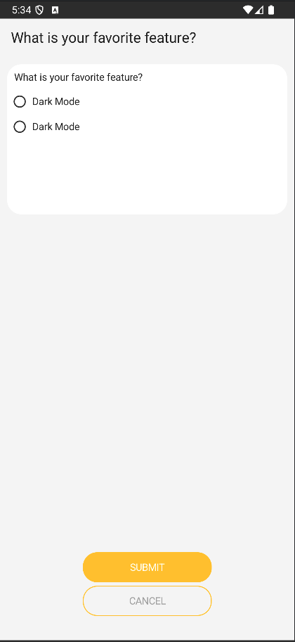
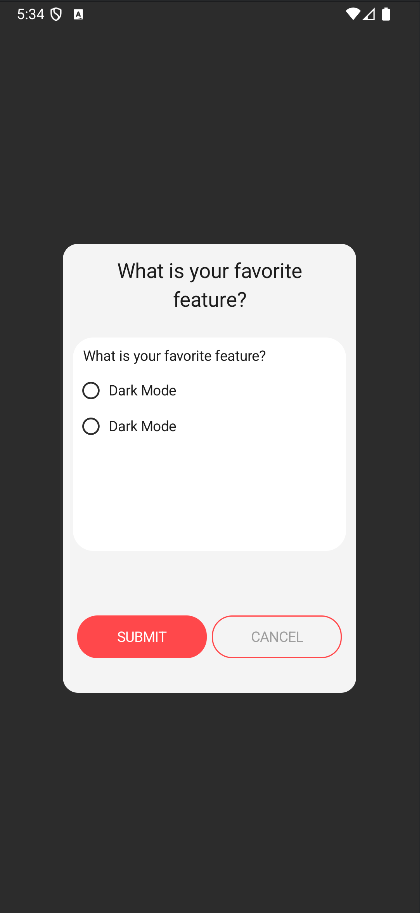
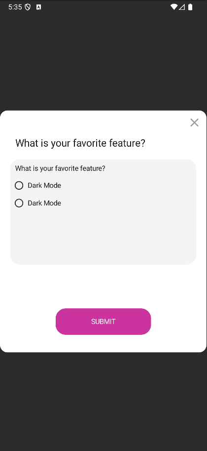
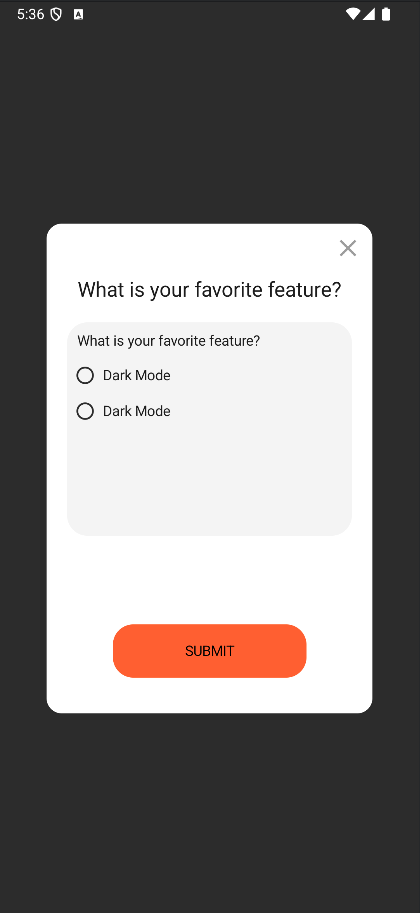
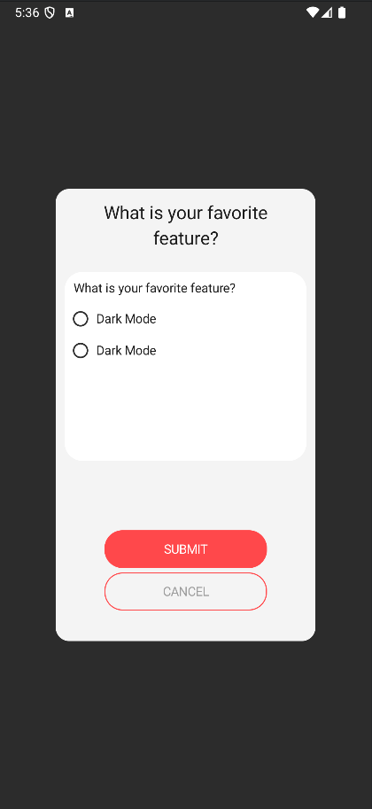

# VoteKit-Android

[](https://jitpack.io/#ControlKit/VoteKit-Android)
[](LICENSE)
[](https://kotlinlang.org/)
[](https://developer.android.com/jetpack/compose)

A powerful and flexible Android library for implementing voting and polling functionality in your mobile applications. Built with Jetpack Compose and modern Android architecture patterns.

## 🎯 Features

- **6 Beautiful UI Styles**: FullScreen and Popover designs for different use cases
- **Easy Integration**: Simple setup with minimal configuration
- **Customizable**: Extensive customization options for colors, layouts, and content
- **Multi-language Support**: Built-in support for English, Persian, Arabic, and more
- **Modern Architecture**: MVVM pattern with Jetpack Compose
- **Error Handling**: Comprehensive error handling with retry mechanisms
- **Local Storage**: Smart caching to prevent duplicate displays
- **Analytics Ready**: Built-in tracking for user interactions

## 📱 Screenshots

### FullScreen Styles
<div align="center">
  
  
</div>

### Popover Styles
<div align="center">
  
  
  
  
</div>

## 🚀 Quick Start

### Installation

Add the JitPack repository to your project's `build.gradle.kts`:

```kotlin
allprojects {
    repositories {
        google()
        mavenCentral()
        maven { url = uri("https://jitpack.io") }
    }
}
```

Add the dependency to your app's `build.gradle.kts`:

```kotlin
dependencies {
    implementation("com.github.ControlKit:VoteKit-Android:0.0.1")
}
```

### Basic Usage

```kotlin
@Composable
fun MyApp() {
    val kit = voteKitHost(
        config = VoteServiceConfig(
            version = "1.0.0",
            name = "MyApp",
            appId = "com.example.myapp",
            viewConfig = VoteViewConfig(
                viewStyle = VoteViewStyle.Popover4
            )
        )
    )
    
    kit.showView()
}
```

### Configuration

Configure your API endpoint in `local.properties`:

```properties
API_URL="https://your-api-domain.com/api/votes"
```

## 🎨 UI Styles

VoteKit offers 6 different UI styles to match your app's design:

| Style | Type | Description | Best For |
|-------|------|-------------|----------|
| **FullScreen1** | Full Screen | Clean, minimal design | Important polls |
| **FullScreen2** | Full Screen | Detailed layout | Comprehensive surveys |
| **Popover1** | Dialog | Overlapping button style | Quick polls |
| **Popover2** | Dialog | Standard popup style | General voting |
| **Popover3** | Dialog | Alternative layout | Custom implementations |
| **Popover4** | Dialog | Modern design | Mobile-first apps |

## 🔧 Customization

### Colors and Styling

```kotlin
VoteViewConfig(
    viewStyle = VoteViewStyle.Popover4,
    popupViewBackGroundColor = Color.White,
    headerTitleColor = Color(0xFF333333),
    submitButtonColor = Color(0xFFE91E63),
    cancelButtonColor = Color.Transparent,
    submitButtonCornerRadius = 12.dp
)
```

### Custom Content

```kotlin
VoteViewConfig(
    viewStyle = VoteViewStyle.FullScreen1,
    headerTitle = "🗳️ Your Opinion Matters",
    submitButtonTitle = "Submit Vote",
    cancelButtonTitle = "Skip This Time",
    toastErrorMessage = "Please select an option before submitting"
)
```

### Advanced Customization

```kotlin
VoteViewConfig(
    viewStyle = VoteViewStyle.FullScreen1,
    
    // Custom header view
    headerTitleView = { title ->
        Card(
            modifier = Modifier.fillMaxWidth(),
            elevation = CardDefaults.cardElevation(defaultElevation = 4.dp)
        ) {
            Text(
                text = title,
                style = MaterialTheme.typography.headlineMedium,
                textAlign = TextAlign.Center,
                modifier = Modifier.padding(16.dp)
            )
        }
    },
    
    // Custom buttons
    submitButtonView = { onClick ->
        Row(
            modifier = Modifier.fillMaxWidth(),
            horizontalArrangement = Arrangement.spacedBy(12.dp)
        ) {
            OutlinedButton(
                onClick = { /* Handle cancel */ },
                modifier = Modifier.weight(1f)
            ) {
                Text("Cancel")
            }
            
            Button(
                onClick = onClick,
                modifier = Modifier.weight(1f)
            ) {
                Text("Submit")
            }
        }
    }
)
```

## 🌍 Multi-language Support

VoteKit supports multiple languages with RTL support:

```kotlin
VoteServiceConfig(
    version = "1.0.0",
    name = "MyApp",
    appId = "com.example.myapp",
    lang = "fa", // Persian
    viewConfig = VoteViewConfig(
        viewStyle = VoteViewStyle.Popover4,
        headerTitle = "نظرسنجی رضایت کاربران",
        submitButtonTitle = "ارسال نظر",
        cancelButtonTitle = "رد کردن"
    )
)
```

## 📊 State Management

Handle different states in your application:

```kotlin
val kit = voteKitHost(
    config = VoteServiceConfig(...),
    onState = { state ->
        when (state) {
            is ViewModelState.ShowView -> {
                Log.d("VoteKit", "Showing vote dialog")
            }
            is ViewModelState.NoContent -> {
                Log.d("VoteKit", "No vote available")
            }
            is ViewModelState.Error -> {
                Log.e("VoteKit", "Error: ${state.data?.message}")
            }
            is ViewModelState.Action -> {
                Log.d("VoteKit", "Vote submitted successfully")
            }
        }
    }
)
```

## 🔌 API Integration

VoteKit communicates with your backend through REST APIs:

### Endpoints

```
GET  /force-updates          # Check for polls
POST /force-updates/{id}/view    # Track view action
POST /force-updates/{id}/submit  # Submit vote
```

### Request Headers

```
x-app-id: {appId}
x-version: {version}
x-sdk-version: {sdkVersion}
x-device-uuid: {deviceId}
x-name: {name}
```

## 📚 Documentation

- **[Project Overview](docs/PROJECT_OVERVIEW.md)** - Detailed project architecture and features
- **[API Documentation](docs/API.md)** - Complete API reference
- **[Examples](docs/EXAMPLES.md)** - Comprehensive usage examples
- **[JitPack Setup](docs/JITPACK_SETUP.md)** - Publishing guide
- **[Migration Guide](docs/MIGRATION.md)** - Version migration instructions
- **[Changelog](docs/CHANGELOG.md)** - Version history

## 🏗️ Architecture

VoteKit follows modern Android architecture patterns:

- **MVVM Pattern**: Clean separation of concerns
- **Jetpack Compose**: Modern declarative UI
- **Repository Pattern**: Centralized data access
- **StateFlow**: Reactive state management
- **Error Handling**: Comprehensive error management

## 🔒 Security & Privacy

- **HTTPS Only**: Secure API communication
- **No Sensitive Data**: No personal information stored
- **Input Validation**: Sanitized user inputs
- **GDPR Compliant**: Privacy-friendly design

## 🤝 Contributing

We welcome contributions! Please see our [Contributing Guidelines](CONTRIBUTING.md) for details.

1. Fork the repository
2. Create your feature branch (`git checkout -b feature/AmazingFeature`)
3. Commit your changes (`git commit -m 'Add some AmazingFeature'`)
4. Push to the branch (`git push origin feature/AmazingFeature`)
5. Open a Pull Request

## 📄 License

This project is licensed under the MIT License - see the [LICENSE](LICENSE) file for details.

## 🙏 Acknowledgments

- [Jetpack Compose](https://developer.android.com/jetpack/compose) for the modern UI toolkit
- [Material Design 3](https://m3.material.io/) for the design system
- [Retrofit](https://square.github.io/retrofit/) for network communication
- [Error Handler Library](https://github.com/Morteza-Sakiyan/ErrorHandler) for error management

## 📞 Support

- **Documentation**: Check our comprehensive [docs](docs/) folder
- **Issues**: Report bugs and request features on [GitHub Issues](https://github.com/ControlKit/VoteKit-Android/issues)
- **Discussions**: Join our [GitHub Discussions](https://github.com/ControlKit/VoteKit-Android/discussions)
- **Email**: Contact us at support@controlkit.com

## 🚀 Roadmap

- [ ] Enhanced caching mechanisms
- [ ] Offline support
- [ ] Custom animation support
- [ ] Additional UI themes
- [ ] Advanced analytics integration
- [ ] A/B testing support

---

**VoteKit** - Empowering developers to create engaging voting experiences! 🗳️

Copyright (c) 2024 ControlKit

Made with ❤️ by the ControlKit team